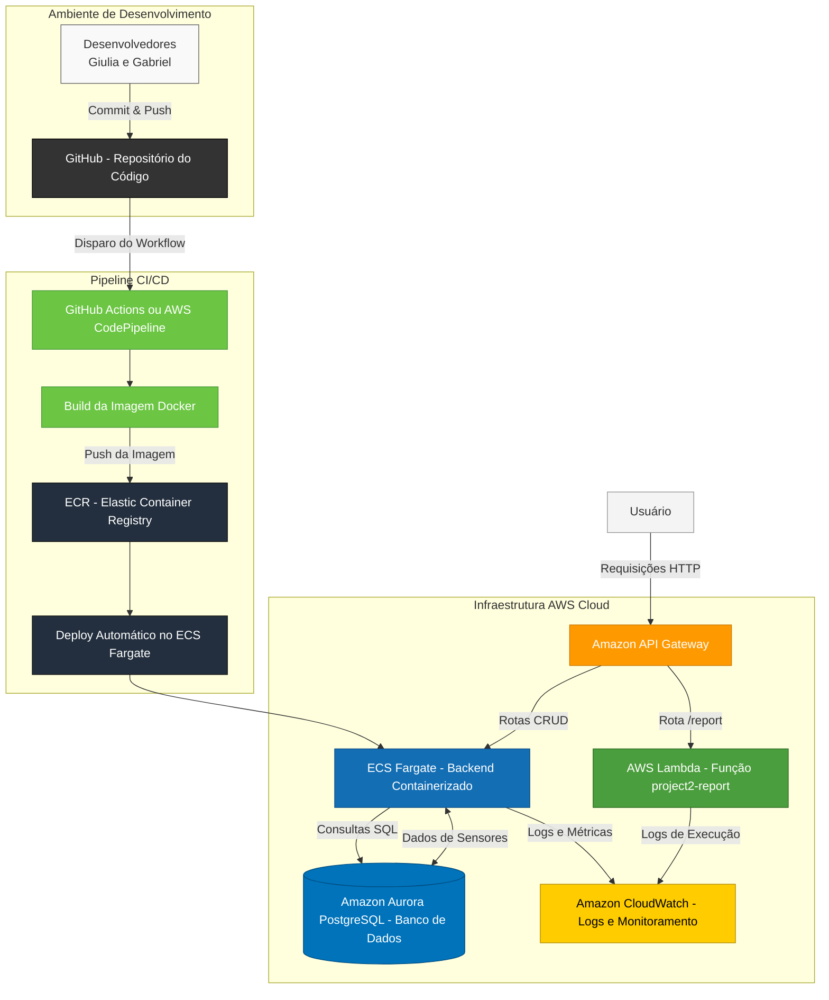

# 🛰️ Projeto Integrador – Cloud Developing 2025/1

> CRUD simples + API Gateway + Lambda /report + RDS + CI/CD  
> Tema: **Monitoramento de Sensores (IoT Basic)**

---

## 👥 Grupo
1. 10401908 - Giulia Barros Gondim - Backend e integração com RDS  
2. 10416808 - Gabriel Bello - Configuração AWS ECS e API Gateway  


---

## 1. 🎯 Visão Geral
O projeto **Monitoramento de Sensores (IoT Basic)** permite cadastrar, listar, atualizar e remover sensores IoT. Cada sensor possui: ID, nome, tipo, valor e data da última leitura.  
A aplicação roda em **ECS Fargate**, utilizando **RDS MySQL privado**, **API Gateway** para expor as rotas e **Lambda** para gerar relatórios estatísticos `/report`.  

---

## 2. 🏗️ Arquitetura



| Camada    | Serviço             | Descrição |
|-----------|-------------------|-----------|
| Backend   | ECS Fargate        | API REST Node.js conectada ao RDS MySQL |
| Banco     | Amazon RDS         | MySQL em subnet privada |
| Gateway   | API Gateway        | Rotas CRUD → ECS · `/report` → Lambda |
| Função    | AWS Lambda         | Consome a API via HTTP e gera estatísticas JSON |
| CI/CD     | CodePipeline + GitHub | Push → Build → ECR → Deploy ECS |

---

## 3. 🚀 Como rodar localmente

```bash
cp .env.example .env
docker compose up --build
# API em http://localhost:3000
